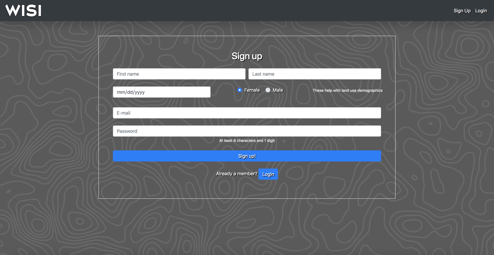
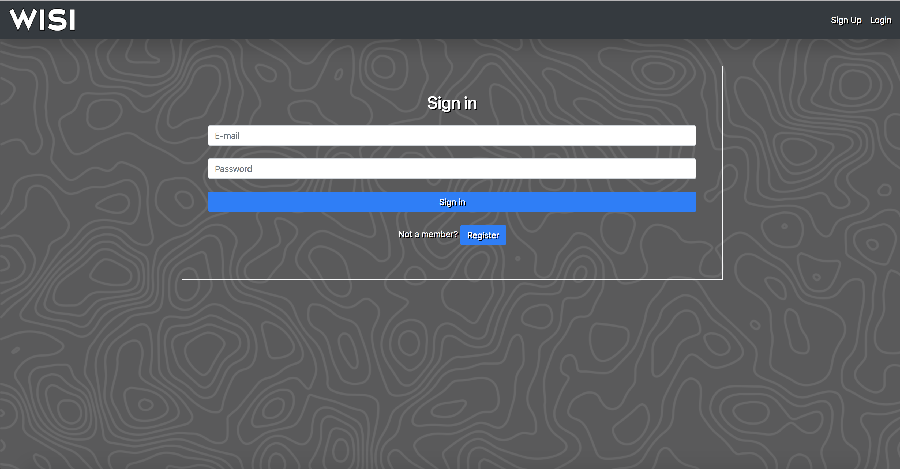
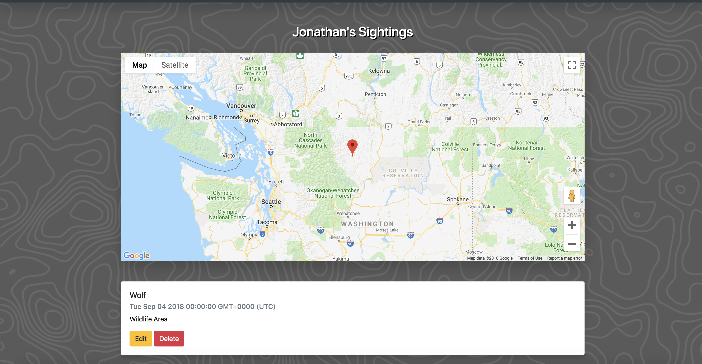
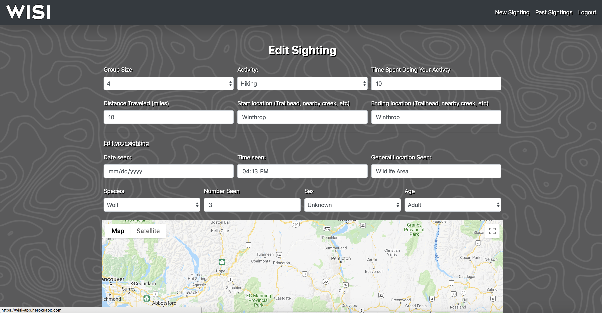
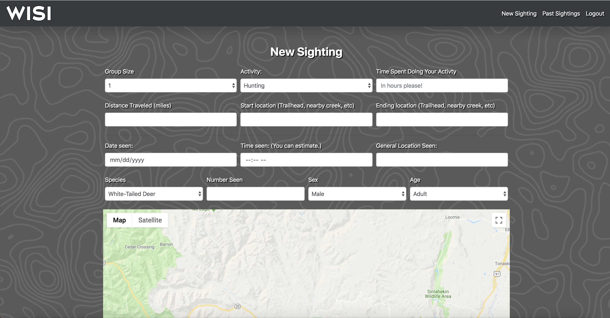

# Citizen Wildlife Science

In the field of wildlife biology, often one of the hardest aspects of studying any given species is simply finding it within vast natural landscapes. This issue of detection has been addressed through a variety of techniques from walking transect lines to radio telemetry to use of airplanes for aerial surveys. Each of these methods have their own unique pros and cons which necessitate their use.

One often underutilized method of detection is the ability to survey recreational users and rural landscape owners who often encounter any number of wildlife but are unable to report their discoveries in a manner that is both convenient for them and also useful to researchers. 

The aim of this project is to provide a platform that would allow users to report their wildlife sightings along with key information which could make their sightings both a great experience and a key scientific contribution.

## What it includes

* Sequelize models and migration for creating user accounts and widlife sighting information
* Setting for PostgreSQL
* Passport and Passport-Local for authentication
* Express sessions to keep user loggedin from page to page
* Connect-Flash for error/success messages
* Bcrypt for hashing passwords preventing access to sensitive information
* Google maps API to allow accurate location data

### User Model

| Column Name | SQL Type | Notes							|
|_____________|__________|__________________________________|
| id | Integer | Serial primary key|
| createdAt | Date | Automatically generated |
| updatedAt | Date | Automatically generated |
| firstname | String | - |
| lastname | String | - |
| email | String | usernameField for login |
| password | String | Hashed with bcrypt |
| dob | Date | - |
| gender | string | user gender for demographics|
| admin | Boolean | Admin or regular user |

### Wildlife Model

| Column Name | SQL Type | Notes							|
|_____________|__________|__________________________________|
| id | Integer | Serial primary key|
| createdAt | Date | Automatically generated |
| updatedAt | Date | Automatically generated |
| date | Date | Date of sighting |
| time | Time | Time of sighting |
| userId | Integer | Connect sighting to a user |
| species | String | Species seen |
| animal_count | Integer | Number of animals seen |
| sex | String | Sex of animal |
| age | String | Age if known |
| general_location | String | General description of area |
| latitude | Integer | Latitude from map pin |
| longitude | Integer | Longitude from map pin |
| comments | String | Additional comments |
| group_size | Integer | Number of people in group |
| activity | String | Activity people were doing |
| effort_time | Integer | Length of time doing activity |
| effort_distance | Integer | Distance travelled |
| start_point | String | Where activity started |
| end_point | String | Where activity ended |

### Default Routes Supplied

| Method | Path | Location | Purpose |
|________|________________|______________________|________________________________________|
| GET | / | server.js| Home Page|
| GET | /auth/login| controllers/auth.js | Login form page |
| POST | /auth/login | controllers/auth.js | Login submission + Redirect to past sightings |
| GET | /auth/signup | controllers/auth.js | Signup form page |
| POST | /auth/signup | controllers/auth.js | Signup submission + Redirect to login |
| GET | /auth/logout | controllers/auth.js | Logout + redirect home |
| GET | /profile/pastsight | controllers/profile.js | View past sightings |
| GET | /profile/edit/:id | controllers/profile.js | Edit a past sighting |
| PUT | /profile/edit/:id | controllers/profile.js | Edit submission + redirect to past sightings |
| DELETE | /profile/:id | controllers/profile.js | Deletes a sighting |
| GET | /profile/newsight | controllers/profile.js | New sighting form page |
| POST | /profile/newsight | controllers/profile.js | New sighting submission |

## Steps to use

#### 1. Visit the site (https://wisi-app.herokuapp.com/) and you'll be directed to the homepage.

#### 2. If you've never visited, click "Sign Up" to create an account.

#### 3. If you have visited, click "Login" sign into your account.

#### 4. After logging in or signing up, you will be directed to the past sightings page.

#### 5. While on past sightings, you can edit or delete past sightings.

 
#### 6. To log a new sighting, click "new sighting" and complete the form. Drag the map marker to mark a location.

#### 7. That's all there is to it.

## Next Steps

As time permits, I'd like to add functionality that would allow for mobile location gathering, the ability to see wildlife "hotspots", and the ability to add images.

## Making Changes
Suggestions are always welcome. Feel free to send pull requests if you feel motivated to do so.